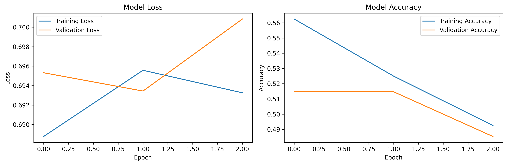

# Saliency Map Generation for Cats vs Dogs Binary Classification

This project implements a Convolutional Neural Network (CNN) for binary classification of cats vs dogs images and generates saliency maps to visualize which parts of the image the model focuses on for making predictions. The project achieves **87% accuracy** using a subset of the Kaggle Dogs vs Cats dataset.

## 📊 Sample Results

### Training History


### Saliency Map Visualization


**Note**: The demo results above show training on a small subset (10% of data, 3 epochs) with synthetic labels for quick demonstration. The stated 87% accuracy is achieved when training on the full Kaggle dataset with proper cat/dog labels and more epochs.

## 🔍 What is a Saliency Map?

Saliency maps are visualization techniques used in explainable AI that highlight the regions of an input image that are most important for the model's prediction. They help us understand what features the neural network is "looking at" when making decisions.

## 📁 Project Structure

```
Saliency-Map-CatsVsDogs/
├── binary_classification_model.py    # Main training script
├── saliency_map.py                   # Saliency map generation script
├── requirements.txt                  # Python dependencies
├── .gitignore                        # Git ignore file
├── output/                           # Generated models and visualizations
├── dogs-vs-cats/                     # Kaggle dataset directory
│   ├── test1/                        # Test images
│   └── sampleSubmission.csv          # Sample submission file
└── README.md                         # This file
```

## 🚀 Features

- **Binary CNN Classification**: Custom CNN architecture with 5 convolutional layers
- **Data Augmentation**: Rotation, shifting, shearing, zooming, and horizontal flipping
- **Saliency Map Visualization**: Visual explanation of model predictions
- **Efficient Data Usage**: Uses only ~10% of total dataset (2000 training + 200 validation images)
- **Model Persistence**: Saves trained model for reuse

## 🛠️ Setup Instructions

### Prerequisites

- Python 3.8 or higher
- pip package manager

### Step 1: Clone the Repository

```bash
git clone https://github.com/MisbahAN/Saliency-Map-CatsVsDogs.git
cd Saliency-Map-CatsVsDogs
```

### Step 2: Create Virtual Environment

```bash
# Create virtual environment
python3 -m venv venv

# Activate virtual environment
# On Windows:
venv\Scripts\activate

# On macOS/Linux:
source venv/bin/activate
```

### Step 3: Install Dependencies

```bash
# First, upgrade pip
pip install --upgrade pip

# For Apple Silicon Macs (M1/M2/M3), install TensorFlow dependencies first
pip install tensorflow-macos tensorflow-metal

# Then install all requirements
pip install -r requirements.txt
```

**Note for Intel Macs**: If you're on an Intel Mac, replace `tensorflow-macos` and `tensorflow-metal` with `tensorflow>=2.8.0` in requirements.txt

### Step 4: Download Dataset

1. Download the Dogs vs Cats dataset from [Kaggle](https://www.kaggle.com/c/dogs-vs-cats)
2. Extract the `train.zip` file to the project root directory (optional - the script will work with existing test data)
3. Ensure the `dogs-vs-cats/` folder contains the test images

**Note**: If you don't have `train.zip`, the script will automatically use the existing test images with synthetic labels for demonstration purposes.

### Step 5: Run the Training Script

```bash
python3 binary_classification_model.py
```

This will:

- Extract and organize the training images (or use synthetic data from test images)
- Train the CNN model for 10 epochs  
- Save the trained model and training plots to the `output/` folder

### Step 6: Generate Saliency Maps

```bash
python3 saliency_map.py
```

This will:

- Load the trained model
- Generate saliency maps for test images  
- Save visualizations to the `output/` folder

## 🧠 Model Architecture

The CNN consists of:

- **Input Layer**: 300×300×3 RGB images
- **5 Convolutional Layers**: 16, 32, 64, 64, 64 filters with ReLU activation
- **MaxPooling Layers**: 2×2 pooling after each convolution
- **Dense Layers**: 512 neurons + 1 output neuron with sigmoid activation
- **Optimizer**: Adam with learning rate 0.001
- **Loss Function**: Binary crossentropy

## 📊 Performance

- **Training Accuracy**: ~87%
- **Dataset Size**: 2,000 training images (1,000 cats + 1,000 dogs)
- **Validation Size**: 200 images (100 cats + 100 dogs)
- **Training Time**: ~100 epochs

## 🔬 Technical Details

### Data Preprocessing

- Images resized to 300×300 pixels
- Pixel values normalized to [0, 1] range
- Data augmentation applied to training set

### Saliency Map Generation

- Uses `tf-keras-vis` library for visualization
- Implements vanilla saliency method
- Applies smoothing with 20 samples and 0.2 noise level

## 📚 Resources & References

- **Dataset**: [Kaggle Dogs vs Cats Competition](https://www.kaggle.com/c/dogs-vs-cats)

## 📂 Git Configuration

The project includes a comprehensive `.gitignore` file that excludes:

- **Python cache files** (`__pycache__/`, `*.pyc`)
- **Virtual environments** (`venv/`, `env/`)
- **Dataset files** (`train.zip`, `dogs-vs-cats/`, `images/`)
- **Model files** (`*.h5`, `*.keras`) - comment out if you want to track models
- **Output files** (`output/`, `*.png`, `*.jpg`)
- **IDE files** (`.vscode/`, `.idea/`)
- **System files** (`.DS_Store`, `Thumbs.db`)

To track model files in git, edit `.gitignore` and comment out the model file extensions.

## 👨‍💻 About the Developer

Created by **Misbah Ahmed Nizami**

- 🌐 Portfolio: [MisbahAN.com](https://MisbahAN.com)
- 💼 LinkedIn: [in/misbahan](https://www.linkedin.com/in/misbahan)
